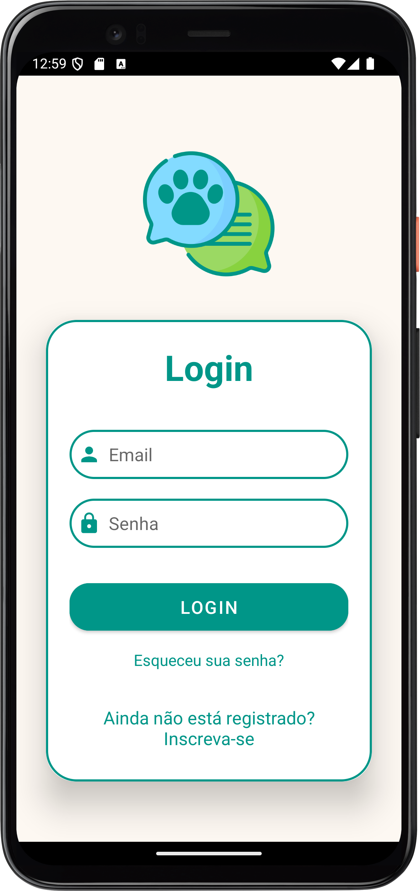
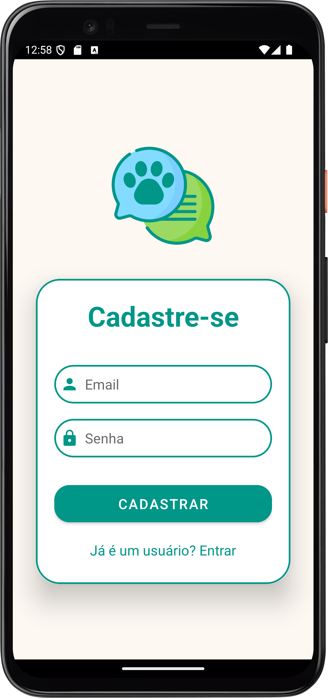
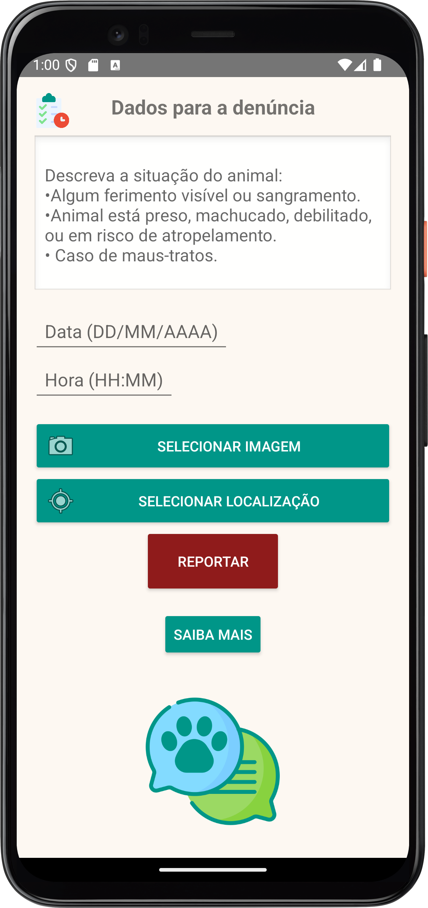
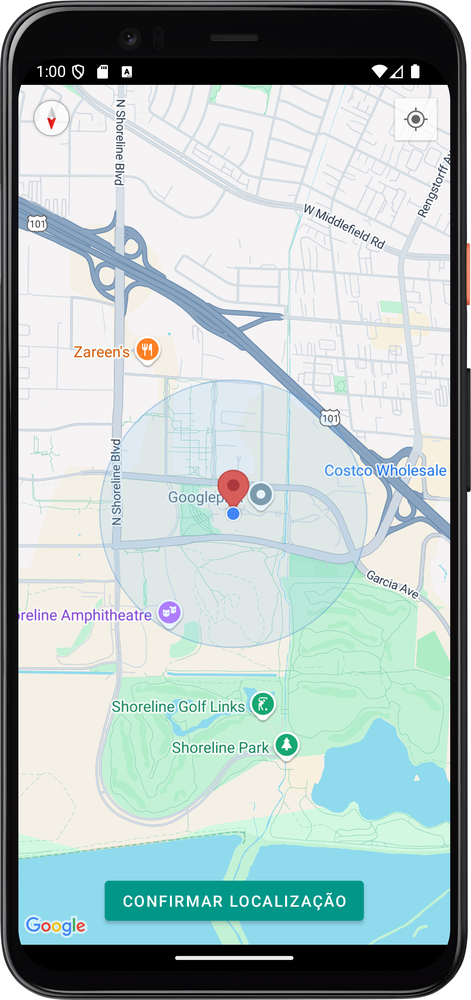
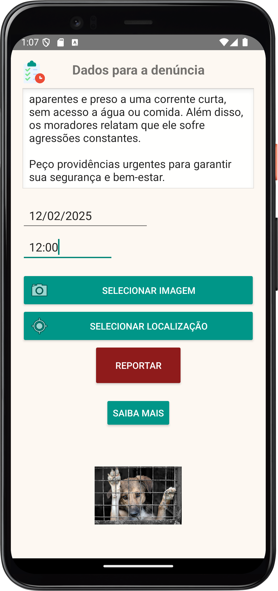
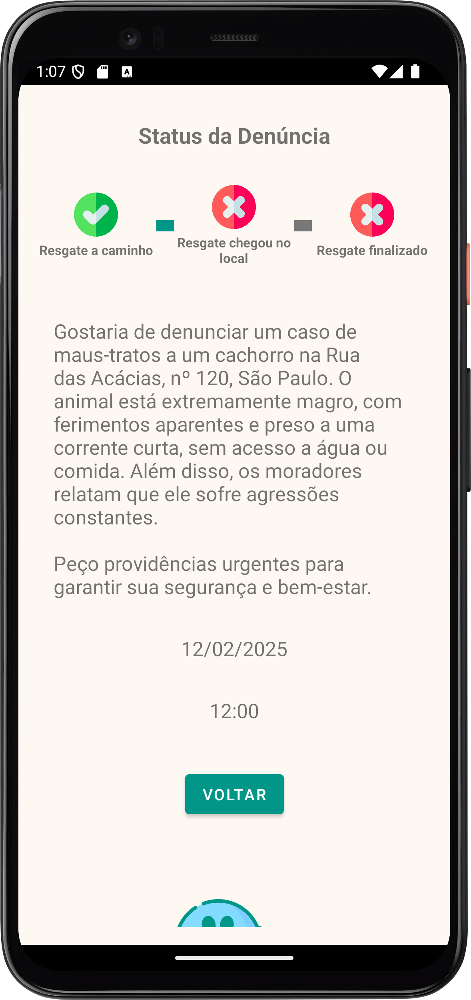

# 🐾 SOS Vida Animal

## 📌 Sobre o Projeto
O **SOS Vida Animal** é um aplicativo desenvolvido para ajudar na localização e resgate de animais abandonados. Ele permite que usuários registrem ocorrências de animais em situação de risco, fornecendo informações detalhadas e localização por GPS.

## ✨ Funcionalidades
- 📍 **Registro de Ocorrências**: Permite que os usuários informem sobre animais em situação de abandono ou perigo.
- 📸 **Upload de Fotos**: Os usuários podem enviar imagens para ajudar na identificação dos animais.
- 🌍 **Geolocalização**: Usa a API do Google Maps para marcar a localização do animal.
- 📊 **Listagem de Ocorrências**: Um painel onde todas as ocorrências registradas são listadas e atualizadas em tempo real.
- 🔔 **Notificações**: Envio de alertas para voluntários e organizações de resgate.

## 🛠 Tecnologias Utilizadas
- **Linguagem**: Java & XML
- **IDE**: Android Studio
- **Banco de Dados**: Firebase Realtime Database
- **APIs**:
  - Google Maps API (para geolocalização)
  - Firebase Authentication (para autenticação de usuários)
  
## 📱 Como Executar o Projeto no Android Studio
### 📥 Requisitos
- Android Studio instalado
- Conta no Firebase configurada
- API Key do Google Maps ativada

### 📌 Passos para Configuração
1. Clone o repositório:
   ```bash
   git clone https://github.com/seu-usuario/app-sos-vida-animal.git
   ```
2. Abra o projeto no Android Studio.
3. Configure o Firebase no projeto:
   - Adicione o arquivo `google-services.json` na pasta `app/`.
   - Certifique-se de que as dependências do Firebase estão no `build.gradle`.
4. Compile e execute no emulador ou em um dispositivo físico.

## 📷 Capturas de Tela
### Android
<p align="center">
  &nbsp;
  &nbsp;
  
  &nbsp;
  &nbsp;
  &nbsp;
  &nbsp;
</p>

## 🐶 Contribuição
Sinta-se à vontade para contribuir com melhorias e novas funcionalidades! Basta abrir um **Pull Request** ou relatar um problema na aba de **Issues**.

## 📄 Licença
Este projeto está licenciado sob os termos da **MIT License**. Consulte o arquivo [LICENSE](./LICENSE) para mais detalhes.
